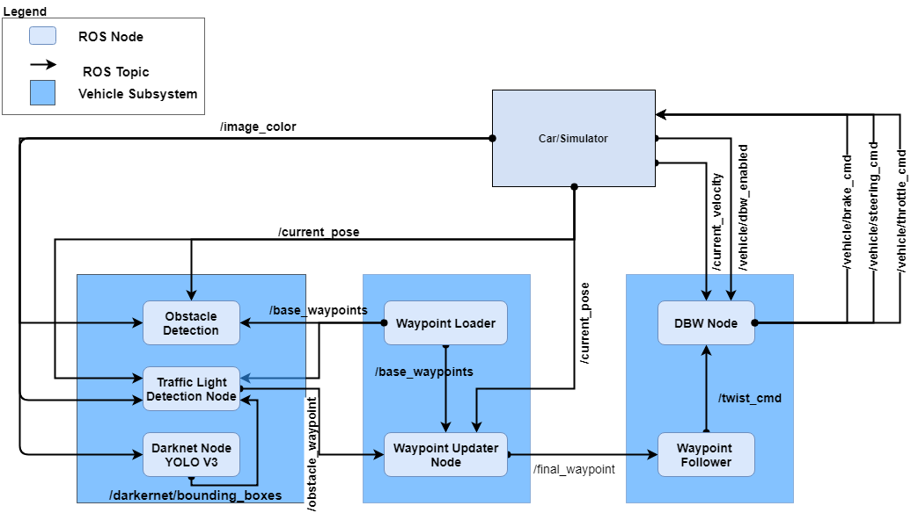
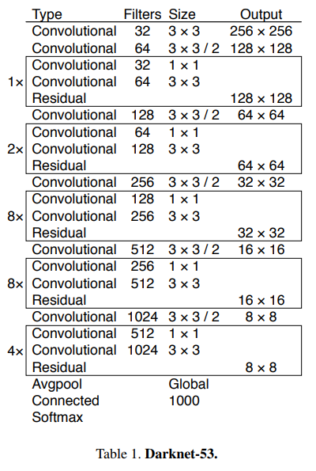
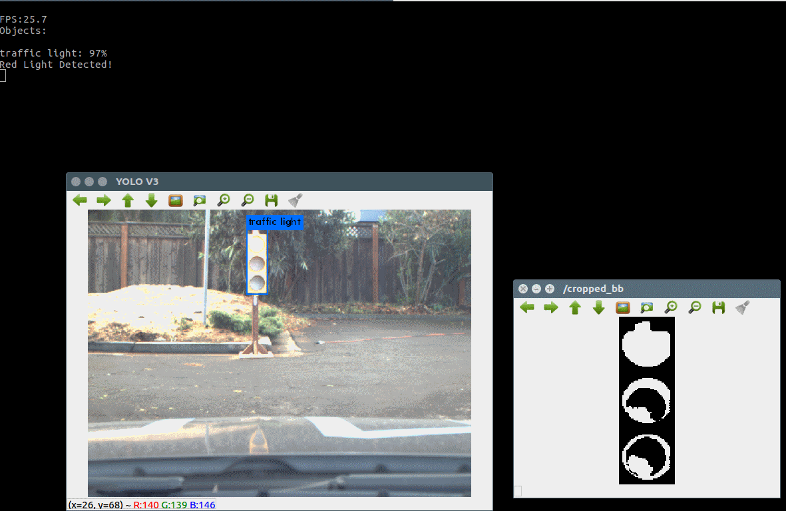
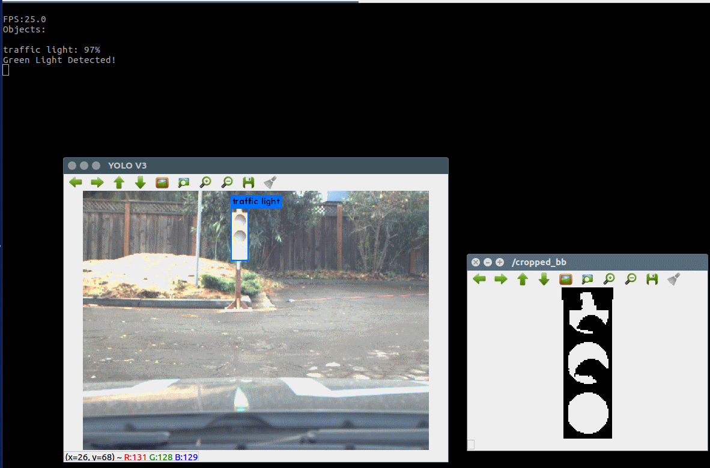

# Team RunCarla - Udacity Self-Driving Car Capstone

This is the project repo for the final project of the Udacity Self-Driving Car Nanodegree: Programming a Real Self-Driving Car. For more information about the project, see the project introduction.


| Team RunCarla              
|:-----------------
| Shridhar Rasal
| Arjun Bhasin 
| Swapnil More
| Manish Ramaswamy
| Wilson Fong


## Introduction

In this project, we developed software which allows Carla, the Udacity Autonomous Car, to run smoothly on a given trajectory of waypoints using its Drive-By-Wire interface while detecting Traffic Lights and reacting accordingly.

## Installation Instructions

Please Note: For successful installation and implementation, it is recommended to use ROS Kinetic on Ubuntu 16.04 running on a system with i7 CPU, 16GB of RAM, Nvidia GTX 1070 or better with CUDA 9.0 or above drivers installed.


1. Clone/Download the repo.
2. Install python dependencies
```bash
cd CarND-Capstone
pip install -r requirements.txt
```
3. Make and run styx
```bash
cd ros
catkin_make
source devel/setup.sh
roslaunch launch/styx.launch
```
4. Run the simulator

## ROS Architecture

Below is the RunCarla ROS node architecture with the publish and subscribe topics. 



## Planning Subsystem

### Waypoint Node

We implemented two key behaviors in the waypoint node.
1. Generate the next 200 waypoints.
2. If a red traffic light is ahead, decelerate the car just before the traffic light stop line.

A key responsibility of the Waypoint Node is to publish the next 200 upcoming waypoints ahead of the car. With the waypoints for the track At the start of the simulation, the waypoints for the road are published. Based on the current car position, the Waypoint Node will find the nearest waypoint to the car and publish the 200 waypoints after the closest point. We had to ensure that the point was ahead of the car and not behind the car. 

The other major responsibility address is to respond to red traffic light ahead of the car. Given, the red light detection from the TL_Detector, the Waypoint Node will create waypoints to decelerate the car. This is done below. Based on the stop line point provided by the TL detector, we compute the distance from the closest waypoint to the car to two points before the stop line waypoint. The two points before the stop line give us a buffer to stop. Essentially, it computes the distance to the stop location, and compute the velocity based on an empirically determined formula.

**...Need some explanation of the twist.twist.linear.x...**


```
    # Important function
    # Warning: Do not modify the original base_waypoints list (that message comes only once)
    def decelerate_waypoints(self, waypoints, closest_idx):
        temp = []
        for i , wp in enumerate(waypoints):
            p = Waypoint()
            p.pose = wp.pose

            # 2 is subtracted to ensure that the front of the car stops at the stop line
            stop_idx = max(self.stopline_wp_idx - closest_idx - 2, 0)
            # Sum of distance between waypoints (sum of line segments)
            dist = self.distance(waypoints, i, stop_idx)

            # We can experiment with other functions too as this is quite steep 
            vel = math.sqrt(2 * MAX_DECEL * dist)
            if vel < 1.:
                vel = 0

            p.twist.twist.linear.x = min(vel, wp.twist.twist.linear.x)
            temp.append(p)

        return temp
```

Based on the current state, our waypoint generator, generate_lane(), will invoke the appropriate routine, see the snippet from this function. 

```

        # If no traffic light was detected, publish the base_waypoints as it is
        if (self.stopline_wp_idx == -1) or (self.stopline_wp_idx >= farthest_idx):
            lane.waypoints = base_waypoints
        else:
            lane.waypoints = self.decelerate_waypoints(base_waypoints, closest_idx)

        return lane
```

Finally, the nodes to /final_waypoints to be used by the DBW Node.


## Control Subsystem

### DBW Node

The DBW node is responsible for generating the commands to control the throttle, brake, and steering for the car to stay on the path set by the waypoints.


Subscribes to the topics /current_velocity, /vehicle/dbw_enabled, /final_waypoints/


The controller implements a PID controller for the throttle.


## Perception Subsystem

The perception subsystem comprises a Darknet ROS Node the Darknet a YOLO Deep Learning CNN, [Darknet](https://pjreddie.com/darknet/yolo/), architecture that is adapted for the ROS system and our TL_Detector Node that contains logic for generating a traffic light waypoint and traffic light state detection (RED, YELLOW, GREEN, UNKNOWN).

### Darknet ROS Node

The [Darknet ROS node](https://github.com/leggedrobotics/darknet_ros/). It is a you look only once, YOLO, approach to build a realtime object detector with 80 classes. It has 53 layers, see below.


Darknet uses several messages. For our use, we updated the Darknet node to subscribe to /image_color (via the config file, ros.yaml), and had the TL_Detector node subscribe to the topic /darknet_ros/bounding_boxes.

The Darknet node houses a YOLO V3 CNN object detector that includes traffic lights["YOLOv3: An Incremental Improvement",Redman,2018](https://arxiv.org/abs/1804.02767). The YOLO node publishes the to the topic the bounding boxes of objects it finds in the image:

A bounding box data structure is:
```
string Class
float64 probability
int64 xmin
int64 ymin
int64 xmax
int64 ymax
```
where 
* Class is a string identifying the class. Our interest is in 'traffic light',
* probability is the confidence the YOLOV3 node has in the the classification,
* xmin, ymin, xmax, ymas are the absolute coordinates of the bounding box around the classified object.


### Traffic Light Detection Node
Traffic Light detection subscribes to the /image_color and /darknet_ros/bounding_boxes topic. When it receives an image in /image_color it processes the image via the callback function TL_Detector::image_cb.

For the simulator, since we had the waypoints we could use the waypoints to determine the relative position of the traffic light to the car and only process the closest traffic light.


Under real-world driving, we don't have waypoints; We only have the images.
However, from the YOLOv3 object detector, we receive bounding boxes around the detected traffic light which gives a way to calibrate roughly the distance to the traffic light. Using the simulator, we empirically determined, by driving manually, that when the traffic light bounding boxes had a high probability and a bounding box with a diagonal greater than 85 pixels, that was a good indicator of when we had to process and act on the TL state and stop the car successfully.

So, the bounding boxes from an image were not processed until we reach these criteria when running on site. The processing continued with traffic light state identification.


### TL_Classifier: Classification of traffic light state

Initially, based on the simulator images, we classify the traffic light state by filtering for red, yellow and green colors after converting to the HSV color space. 

While this worked well for the simulator, the classifier worked poorly for the real-world images provided in the rosbag with images captured from the Carla. In the real-world images, the color didn't show well in the video; the video capture mostly the intensity.

The classified image was updated to use two features of the traffic light to determine the TL state, the color of the signal, and the relative positions of the signal within the image.

We first divided the cropped image along the long axis of the detected image into three equal regions. We expect 
1. red area: the top one-third where we expect the most red pixels 
2. yellow area: the middle third where we expect the most yellow pixels
3. green area: the last third where we expect the most green pixels

This worked okay for the site images, but not for the simulator images. To attain a single classifier, we used color boosting to arrive at a classifier that can handle both types of images.

The image color was boosted differentially based on the expected color area.

We used cv2.transform to boost red channel of the red area; the yellow channel was boosted in the yellow area, and the green channel was boosted in the green area.

The three channels were combined to obtain a grayscale image. 

We then applied a grayscale threshold of pixels with intensities between 210 and 255 and then classified as follows;

1. Red if the red area count was greater than the yellow and green area counts.
2. Yellow if the yellow area count was greater than the red or green area counts
3. Green if green counts greater than red and yellow counts.

Below are examples from the site:






