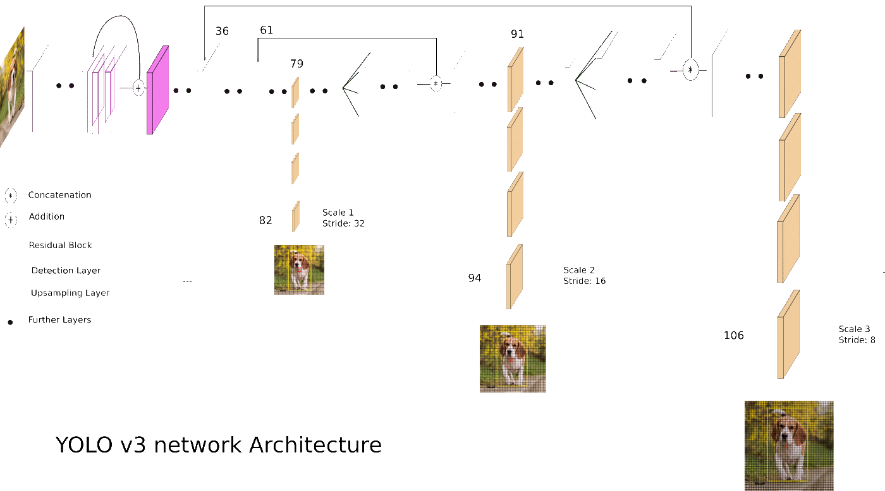

# Team RunCarla - Udacity Self-Driving Car Capstone

This is the project repo for the final project of the Udacity Self-Driving Car Nanodegree: Programming a Real Self-Driving Car. For more information about the project, see the project introduction.


| Team RunCarla  | email | 
|:-----------------|:-------|
| Shridhar Rasal  (Lead) |rasal1710@gmail.com|
| Arjun Bhasin     |arjunbhasin.pec@gmail.com| 
| Swapnil More     |smore@g.clemson.edu|
| Manish Ramaswamy |manish.ram@gmail.com|
| Wilson Fong       |wfong443@gmail.com|


## Introduction

In this project, we developed software to drive Carla, the Udacity autonomous car. The autonomous car is, in essence, a robot. The project's goal is to provide the robotic vehicle with the ability to plan a route and drive the course. During the drive, the car will drive smoothly while detecting traffic lights, react accordingly and drive within the lanes.

## Installation Instructions

Please Note: For successful installation and implementation, it is recommended to use ROS Kinetic on Ubuntu 16.04 running on a system with i7 CPU, 16GB of RAM, Nvidia GTX 1070 or better with CUDA 9.0 or above drivers installed.


##### Clone/Download [this repo](https://github.com/namoshri/RunCarla-Capstone)
```bash
git clone https://github.com/namoshri/RunCarla-Capstone.git
```

##### Install python dependencies
```bash
cd RunCarla-Capstone
pip install -r requirements.txt
```

##### Download darknet_ros
In order to install darknet_ros, clone the latest version using SSH (see [how to set up an SSH key](https://confluence.atlassian.com/bitbucket/set-up-an-ssh-key-728138079.html)) from this repository into workspace.
```bash
cd ros/src
git clone --recursive git@github.com:leggedrobotics/darknet_ros.git
```

##### Apply yml and make changes to darknet_ros
``` bash
cp 0001-update-ros.yml-for-camera-image-and-skip-downloading.patch darknet_ros/
cd darknet_ros
git apply --check  0001-update-ros.yml-for-camera-image-and-skip-downloading.patch && git am < 0001-update-ros.yml-for-camera-image-and-skip-downloading.patch
cd ../../
```
##### Make and run styx
```bash
catkin_make
source devel/setup.sh
roslaunch launch/styx.launch
```
##### Run the simulator
------------

## ROS Architecture

Below is the RunCarla ROS node architecture with the publish and subscribe topics. 


## Planning Subsystem

### Waypoint Node

We implemented two behaviors in the waypoint node.
1. Generate the next 200 waypoints.
2. If a red traffic light is ahead, decelerate the car just before the traffic light stop line.

A Waypoint Node responsibility is to publish the next 200 upcoming waypoints ahead of the car.  At the start of the simulation, the simulator broadcasts the course's waypoints. Based on the current car position, the Waypoint Node will find the nearest waypoint to the car and post the 200 waypoints after the closest point. We had to ensure that the waypoint was ahead of the car and not behind. 

Another responsibility that is vital addresses the situation of a red...Need some explanation of the twist.twist.linear.x... traffic light ahead of the car. Given, the red light detection from the TL_Detector, the Waypoint Node will create waypoints to decelerate the vehicle. The code below produces the waypoints for deceleration. Based on the stop line point provided by the TL detector, we compute the distance from the closest waypoint to the car to two points before the stop line waypoint. The two points before the stop line give us a buffer to stop. Essentially, it computes the distance to the stop location, and calculate the velocity based on an empirically determined formula.


```
    # Important function
    # Warning: Do not modify the original base_waypoints list (that message comes only once)
    def decelerate_waypoints(self, waypoints, closest_idx):
        temp = []
        for i , wp in enumerate(waypoints):
            p = Waypoint()
            p.pose = wp.pose

            # 2 is subtracted to ensure that the front of the car stops at the stop line
            stop_idx = max(self.stopline_wp_idx - closest_idx - 2, 0)
            # Sum of distance between waypoints (sum of line segments)
            dist = self.distance(waypoints, i, stop_idx)

            # We can experiment with other functions too as this is quite steep 
            vel = math.sqrt(2 * MAX_DECEL * dist)
            if vel < 1.:
                vel = 0

            p.twist.twist.linear.x = min(vel, wp.twist.twist.linear.x)
            temp.append(p)

        return temp
```

Based on the current state, our waypoint generator, generate_lane(), will invoke the appropriate routine, see the snippet from this function. 

```

        # If no traffic light was detected, publish the base_waypoints as it is
        if (self.stopline_wp_idx == -1) or (self.stopline_wp_idx >= farthest_idx):
            lane.waypoints = base_waypoints
        else:
            lane.waypoints = self.decelerate_waypoints(base_waypoints, closest_idx)

        return lane
```

Finally, the nodes to /final_waypoints to be used by the DBW Node.


## Control Subsystem


### Drive By Wire (DBW) Node
The DBW node is the final step in the self driving vehicle’s system. At this point we have a target linear and angular velocity and must adjust the vehicle’s controls accordingly. In this project we control 3 things: throttle, steering, brakes. As such, we have 3 distinct controllers to interface with the vehicle.

#### Throttle Controller
The throttle controller is a simple PID controller that compares the current velocity with the target velocity and adjusts the throttle accordingly. The throttle gains were tuned using trial and error for allowing reasonable acceleration without oscillation around the set-point.

#### Steering Controller
This controller translates the proposed linear and angular velocities into a steering angle based on the vehicle’s steering ratio and wheelbase length. To ensure our vehicle drives smoothly, we cap the maximum linear and angular acceleration rates. The steering angle computed by the controller is also passed through a low pass filter to reduce possible jitter from noise in velocity data.

#### Braking Controller
This is the simplest controller of the three. It takes takes into consideration the vehicle mass, the wheel radius, as well as the brake_deadband to determine the deceleration force.  Despite the simplicity, we found that it works well to ensure reasonable stopping distances.


It uses the Controller class from twist_controller.py to calculate the required throttle, brake and steering inputs.
The commands are only published when the driver enables the dbw module.

```

        while not rospy.is_shutdown():

            # If velocity values are published use the control function to calculate the throttle, brake and steering commands.
            if not None in (self.current_vel, self.linear_vel, self.angular_vel):
            	self.throttle, self.brake, self.steering = self.controller.control(self.current_vel,
            														self.dbw_enabled,
            														self.linear_vel,
            														self.angular_vel)

            # if <dbw is enabled>:
            #   self.publish(throttle, brake, steer)
            if self.dbw_enabled:
            	self.publish(self.throttle, self.brake, self.steering)

```

### twist_controller.py

The file defines the Controller class that performs the calculations to get the throttle, steering and brake inputs.

The control function takes the current velocity, linear velocity, angular velocity, dbw enabled flag; and returns the throttle, brake and steering commands

It uses functions from the YawController class in yaw_controller.py to calculate the steering and functions from PID class in pid.py to adjust the throttle depending on the velocity error. It also sets the throttle to zero when the target velocity is less than the current velocity and when the vehicle is stopped.

The brake torque is calculated based on the velocity error and throttle values. If the vehicle is stopped i.e. the reference linear velocity = 0 and the current velocity is below 0.1, the brake torque is a constant 400 N-m, else if the reference velocity is lower than the current velocity & the throttle input is below 0.1, the brake torque is calculated based on the deceleration required, the mass of the vehicle and the wheel radius

It returns the calculated values only if the dbw module is enabled, else it returns a 0 value for all commands.

```

    def control(self, current_vel, dbw_enabled, linear_vel, angular_vel):
        # The function uses the YawController class and PID class to calculate the throttle, steering inputs and applies the brake based on throttle, velocity.
        # Returns throttle, brake, steer

        if not dbw_enabled:
        	self.throttle_controller.reset()
        	return 0., 0., 0.

    	current_vel = self.vel_lpf.filt(current_vel)

    	steering = self.yaw_controller.get_steering(linear_vel, angular_vel, current_vel)

    	vel_error = linear_vel - current_vel
    	self.last_vel = current_vel

    	current_time = rospy.get_time()
    	sample_time = current_time - self.last_time
    	self.last_time = current_time

    	throttle = self.throttle_controller.step(vel_error, sample_time)
    	brake = 0

    	if linear_vel == 0. and current_vel < 0.1:
    		throttle = 0
    		brake = 400 #N-m - to hold the car in place if we stopped at a light. Acceleration ~ 1m/s^2

        elif throttle < .1 and vel_error < 0:
            throttle = 0
            decel = max(vel_error, self.decel_limit)
            brake = abs(decel)*self.vehicle_mass*self.wheel_radius

        return throttle, brake, steering

```

### yaw_controller.py

This file defines the YawController class that converts the target linear and angular velocities to steering commands.

```

    def get_angle(self, radius):
        angle = atan(self.wheel_base / radius) * self.steer_ratio
        return max(self.min_angle, min(self.max_angle, angle))

    def get_steering(self, linear_velocity, angular_velocity, current_velocity):
        angular_velocity = current_velocity * angular_velocity / linear_velocity if abs(linear_velocity) > 0. else 0.

        if abs(current_velocity) > 0.1:
            max_yaw_rate = abs(self.max_lat_accel / current_velocity);
            angular_velocity = max(-max_yaw_rate, min(max_yaw_rate, angular_velocity))

        return self.get_angle(max(current_velocity, self.min_speed) / angular_velocity) if abs(angular_velocity) > 0. else 0.0;

```

### pid.py

This file defines the PID class that calculates the throttle input based on velocity error if the velocity error is positive i.e. the target velocity is more than the current velocity.

```

    def step(self, error, sample_time):

        integral = self.int_val + error * sample_time;
        derivative = (error - self.last_error) / sample_time;

        val = self.kp * error + self.ki * integral + self.kd * derivative;

        if val > self.max:
            val = self.max
        elif val < self.min:
            val = self.min
        else:
            self.int_val = integral
        self.last_error = error

        return val

```


## Perception Subsystem

For this project, the perception subsystem identifies the traffic lights in a video feed from the car's camera. Its job is to provide the recognized traffic light's state and nearest waypoint.

RunCarla's perception subsystem comprises a Darknet ROS Node and our TL_Detector Node.

The Darknet ROS Node is a YOLO real-time object detection system, [Darknet][1], adapted for a ROS system. The TL_Detector node contains logic for generating a traffic light waypoint and traffic light state detection (RED, YELLOW, GREEN, UNKNOWN).

### Traffic Light detection with YOLOv3

YOLO is a real-time objection detection algorithm developed by Joseph Redman. YOLO is trained on the [COCO Dataset][5] and classifies traffic lights among other objects. The acronym expands to [You Only Look Once][6] which means that the image is scanned once during processing, i.e., all steps in the processing is applied as the image is scanned. In contrast, sliding window techniques may scan the image multiple times with different sized windows. A single pass is more efficient, than mulitple passes. 

YOLOv3 is a version of YOLO that takes 320 x 320 image and produces a class and bounding box for all identified objects. The table below lists the YOLOv3 architecture layout. It is a 53 layer CNN that can predict 80 classes.  

From the [original paper][3].


YOLOv3 generates candidate features and bounding boxes at three different scales that are combined into a feature vector as input to the classification step as shown in the diagram below. See this web article for more insight, [What’s new in YOLO v3?][8].

Architectural diagram of Darknet-53 from [web article][8].



We selected Darknet YOLOv3 for the following reasons:
- Detects traffic lights
- Provides the required information - the object's name and bounding box
- Pretrained and ready to use
- ROS implementation was available
- Has high accuracy
- Performance 30 FPS (frames per second) on Titan X


### Darknet ROS Node

The ROS implementation is found here: [Darknet ROS node][2]. Darknet uses several messages. For our use, we updated the Darknet node to subscribe to /image_color (via the config file, ros.yaml) and had the TL_Detector node subscribe to the topic /darknet_ros/bounding_boxes.

The YOLOV3 node publishes results to the topic /darknet/bounding_boxes. 

The bounding box data structure is defined as:
```
string Class
float64 probability
int64 xmin
int64 ymin
int64 xmax
int64 ymax
```
where 
* Class is a string identifying the class. Our interest is in 'traffic light',
* probability is the confidence the YOLOv3 node has in the the classification,
* xmin, ymin, xmax, ymax are the absolute coordinates of the bounding box around the classified object.


### Traffic Light Detection Node
Traffic Light detection subscribes to the /image_color and /darknet_ros/bounding_boxes topic. When it receives an image in /image_color it processes the image via the callback function TL_Detector::image_cb.

For the simulator, since we had the waypoints, we could use the waypoints to determine the relative position of the traffic light to the car and only process the closest traffic light.


Under real-world driving, we don't have waypoints; We only have the images.
However, from the YOLOv3 object detector, we receive bounding boxes around the detected traffic light which gives a way to calibrate roughly the distance to the traffic light. Using the simulator, we empirically determined, by driving manually, that when the traffic light bounding boxes had a high probability and a bounding box with a diagonal greater than 85 pixels, that was a good indicator of when we had to process and act on the TL state and stop the car successfully.

So, the bounding boxes from an image were not processed until we reach these criteria when running on site. The processing continued with traffic light state identification.


### TL_Classifier: Classification of traffic light state

Initially, based on the simulator images, we classify the traffic light state by filtering for red, yellow and green colors after converting to the HSV color space. 

While this worked well for the simulator, the classifier worked poorly for the real-world images provided in the rosbag with images captured from the Carla. In the real-world images, the color didn't show well in the video; the video capture mostly the intensity.

The classified image was updated to use two features of the traffic light to determine the TL state, the color of the signal, and the relative positions of the signal within the image.

We first divided the cropped image along the long axis of the detected image into three equal regions. We expect 
1. red area: the top one-third where we expect the most red pixels 
2. yellow area: the middle third where we expect the most yellow pixels
3. green area: the last third where we expect the most green pixels

This worked okay for the site images, but not for the simulator images. To attain a single classifier, we used color boosting to arrive at a classifier that can handle both types of images.

The image color was boosted differentially based on the expected color area.

We used cv2.transform to boost red channel of the red area; the yellow channel was boosted in the yellow area, and the green channel was boosted in the green area.

The three channels were combined to obtain a grayscale image. 

We then applied a grayscale threshold of pixels with intensities between 210 and 255 and then classified as follows;

1. Red if the red area count was greater than the yellow and green area counts.
2. Yellow if the yellow area count was greater than the red or green area counts
3. Green if green counts greater than red and yellow counts.

Below are examples from the site:


## References

- [Udacity CarND Capstone][4]
- Redmond2016, [You Only Look Once: Unified, Real-Time Object Detection][6]
- Redmond2018, [YOLOv3: An Incremental Improvement][3]
- [Darknet Yolo][1]
- [Darknet ROS][2]
- [COCO Dataset][5]
- [YOLO v3: Better, not Faster, Stronger][8]


[1]: https://pjreddie.com/darknet/yolo/
[2]: https://github.com/leggedrobotics/darknet_ros/
[3]: https://arxiv.org/abs/1804.02767
[4]: https://github.com/udacity/CarND-Capstone
[5]: http://cocodataset.org/#home
[6]: https://arxiv.org/abs/1506.02640
[8]: https://towardsdatascience.com/yolo-v3-object-detection-53fb7d3bfe6b
